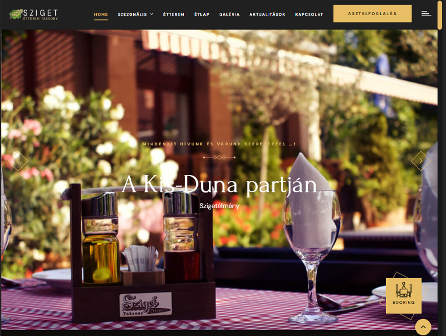

# [Sziget étterem Taksony](https://lebryere.github.io/Sziget-etterem/)

## Browser Support

 |  |  |  |  | 
--- | --- | --- | --- | --- | --- |
94+ ✔ | 92+ ✔ | 89+ ✔ | 82+ ✔ | 87+ ✔ | 55+ ✔ |

## Preview

[](https://lebryere.github.io/Sziget-etterem/)

**[View Live Preview](https://lebryere.github.io/Sziget-etterem/)**

## Status

[](https://raw.githubusercontent.com/LeBryere/Sziget-etteremmaster/LICENSE).

## Usage

### Basic Usage


Das Sziget Restaurant in Taksony hat sich zu einem so ikonischen Ort im Dorf und seiner Umgebung entwickelt, dass jeder Fremde, der sich dorthin verirrt, leicht den Weg findet. Dieses Restaurant, das in den dreißiger Jahren als Weinprobe begann, hat sich im Laufe der Jahrzehnte zu einem emblematischen Ort entwickelt. Es bietet seit Generationen zuverlässige Küche, eine familiäre Atmosphäre und am Sonntag Live-Sramli-Musik für erstklassige Unterhaltung. Der Ort bereichert nicht nur mit seinem Speise- und Getränkeangebot, sondern auch mit Vorträgen, Konzerten, Weinabenden und literarischen Abenden die deutsche Nationalitätenkultur. Die Speisekarte spiegelt die schwäbisch-bayerischen Wurzeln wider, aber das Restaurant engagiert sich auch für ungarische Weine. Das Restaurant, das sich in einem Naturschutzgebiet befindet, bietet nicht nur qualitativ hochwertigen Service, sondern vermittelt auch Liebe und Respekt für Natur und Umwelt, damit auch die zukünftigen Generationen sich mit dem "Sziget-Erlebnis" bereichern können.

### Variables
```css
@import url('global.css');
@import url('swiper.css');
@import url('owl.css');
@import url('preloader.css');
@import url('font-awesome.css');
@import url('simple-line-icons.css');
@import url('animate.css');
@import url('jquery-ui.css');
@import url('jquery.fancybox.min.css');
@import url('custom-animate.css');
```

## Copyright and License

Copyright 2024 Lebryere. Code released under the [](https://raw.githubusercontent.com/LeBryere/Sziget-etteremmaster/LICENSE).
